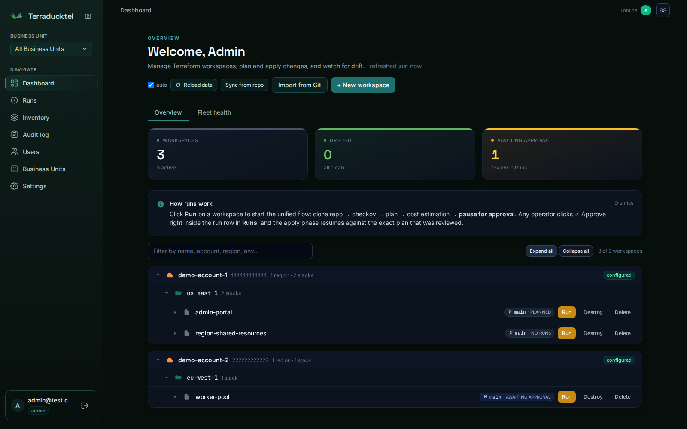
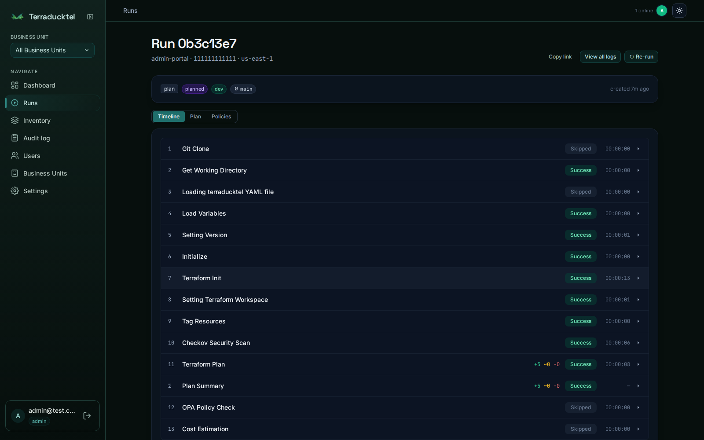
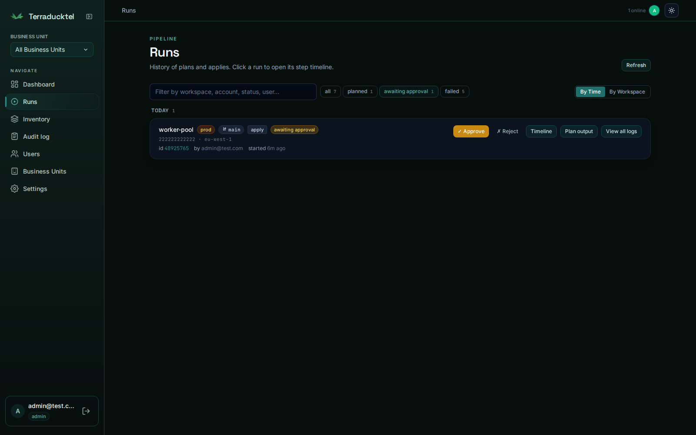

<p align="center">
  
</p>

<h1 align="center">Terraducktel</h1>

<p align="center">
  <strong>Self-hosted Terraform &amp; Helm orchestration.</strong> Plan, gate, apply, and track drift
  across every AWS account and Kubernetes cluster you own &mdash; no SaaS, no seat licenses,
  runs entirely in <code>docker compose</code>.
</p>

<p align="center">
  <a href="services/api/tests"></a>
  <a href="#license"></a>
  <a href="services/api/pyproject.toml"></a>
  <a href="services/executor/Dockerfile"></a>
  <a href="docker-compose.yml"></a>
  <a href="CONTRIBUTING.md"></a>
</p>

> **Status: pre-1.0.** Core flows work end-to-end (workspace import, plan/apply via
> the per-run executor, drift detection, RBAC, audit, AWS-account onboarding with
> encrypted credentials). The [roadmap](#status--roadmap) below tracks what's next.

## Why

Terraform Cloud, Spacelift, and friends are great — until the per-seat bill lands.
Terraducktel is the boring, self-hosted version of the same idea: a small FastAPI
orchestrator + Postgres + your own S3, running on whatever Docker host you already
have, with zero licensing cost and no third party ever touching your state or cloud
credentials.

| | Terraducktel | Typical SaaS orchestrator |
|---|---|---|
| **Cost** | Free, self-hosted | Per-seat / per-workspace pricing |
| **Where your state & creds live** | Your own S3 + Postgres | Their cloud |
| **Multi-tenancy** | Business Units (built in) | Often a paid tier |
| **Helm support** | Same gated pipeline as Terraform | Rare / bolted on |
| **Setup** | `make up` | Contract + SSO negotiation |
| **Customization** | It's your FastAPI app | Whatever the vendor exposes |

## Screenshots

### Dashboard

Every workspace, grouped by AWS account and region, with live drift and approval status.



### Run detail

The full `git clone → checkov → plan → policy → cost` pipeline, step by step, with live output streaming.



### Gated approval

Every `apply` pauses until an operator reviews the *exact* plan and clicks Approve.
Any operator, including the run's own triggering user (4-eyes was tried and retired
— see [`CLAUDE.md`](CLAUDE.md)).



## What it does

- **Plan and apply** Terraform stacks from a Git repo or a mounted folder,
  one ephemeral container per run, with per-step status and duration in the UI.
- **Gated approval** — every apply pauses at `awaiting_approval` until an
  operator+ reviews the plan and approves it; the FSM enforces the gate
  (any operator+ may approve, including the run's own triggering user — see
  [`CLAUDE.md`](CLAUDE.md) on 4-eyes being revoked).
- **Per-account state isolation** — each AWS account has its own dedicated S3
  bucket; the state-file path mirrors the git folder layout 1:1.
- **Encrypted credentials at rest** — AWS access/secret pairs and integration
  tokens (GitHub PAT, Slack URL, SMTP password) are stored Fernet-encrypted
  with an HKDF-derived key. Plaintext never leaves the request handler.
- **Drift detection** — a background worker periodically `terraform plan`s
  every workspace and surfaces drift in the UI.
- **Git-tree workspace import** — point Terraducktel at a repo that follows the
  `account-<id>/<region>/<leaf-folder>/` convention and bulk-import every
  stack as a workspace, with auto-detected environment per leaf.
- **Helm, through the same gate** — a workspace can target a Kubernetes cluster
  instead of an AWS account; `helm diff` replaces `terraform plan`, same
  approval FSM, same audit trail.
- **Multi-tenant Business Units** — each BU owns its own AWS accounts, K8s
  clusters, GitHub integration, and workspaces; superadmins can see across all
  of them for break-glass ops.
- **Auditable everywhere** — every privileged action (run trigger, approval,
  role change, account deletion) is recorded in the `audit_log` table and
  visible in the UI.

## Why we built it

Replaces a SaaS Terraform orchestrator that was costing four figures a month
with a fully self-hosted alternative running entirely in `docker compose`.
Architecture is intentionally thin: a FastAPI orchestrator + Postgres + S3 +
ephemeral executor containers. No Java, no Kubernetes operator, no proprietary
runtime.

---

## Architecture

```
┌──────────┐     ┌─────────────────┐     ┌────────────────┐
│  React   │────▶│   FastAPI API   │◀───▶│   Postgres     │
│   UI     │     │  (orchestration │     │  (workspaces,  │
│  :3001   │     │   + RBAC + FSM) │     │   runs, audit) │
└──────────┘     │      :8001      │     └────────────────┘
                 └────────┬────────┘
                          │ docker.sock
                          ▼
              ┌────────────────────────┐
              │  Executor (per run)    │
              │  hashicorp/terraform   │     ┌──────────────┐
              │  + checkov + git/jq    │────▶│   AWS S3     │
              │                        │     │  (state, per │
              │  init → plan → apply   │     │   account)   │
              └────────────────────────┘     └──────────────┘
```

| Service          | What it does                                                                    |
| ---------------- | ------------------------------------------------------------------------------- |
| `api`            | FastAPI orchestrator, run/approval state machine, Terraform HTTP-state backend. |
| `ui`             | React + Tailwind frontend served by nginx (also reverse-proxies `/api/*`).      |
| `postgres`       | Workspaces, runs, run-steps, AWS accounts (encrypted), audit log, drift reports. |
| `localstack`     | Fake AWS S3 for dev / fallback bucket.                                          |
| `executor`       | Ephemeral container spawned per run; clones the repo, runs `terraform`.         |
| `drift-detector` | Background worker that periodically `terraform plan`s every workspace.          |
| `forgejo`        | Self-hosted Git (optional); workspaces can target external GitHub too.          |
| `act_runner`     | Forgejo's GitHub-Actions-compatible runner (optional).                          |
| `traefik`        | Reverse proxy with auto-TLS for production deploys (optional in dev).           |

## Quick start

```bash
git clone https://github.com/YOUR_ORG/terraducktel.git
cd terraducktel
cp .env.example .env

# Edit .env, set at least:
#   POSTGRES_PASSWORD       (any string)
#   CREDENTIAL_ENCRYPTION_KEY  (any 32-byte string; protects all secrets at rest)
#   JWT_SECRET_KEY          (any 32-byte string)
#   TERRADUCKTEL_STATE_TOKEN    (any 32-byte string; protects the TF state backend)

docker compose up -d postgres localstack api ui
docker compose exec -T api alembic upgrade head
docker compose exec -T api python scripts/seed_dev_users.py
```

Open <http://localhost:3001> and sign in as `admin@test.com` / `password123`
(seeded for dev — change immediately in production).

### First-run checklist

1. **Settings → GitHub credentials** — paste a personal access token with
   `repo` read scope so the executor can clone private terraform modules.
2. **AWS Accounts → + Add AWS account** — enter the 12-digit account ID, a
   display name, the dedicated S3 bucket for state, and the access/secret
   key pair. Click **Test credentials** to verify; if the bucket doesn't
   exist yet, click **Create bucket** to bootstrap one with versioning + AES256
   + public-access-block all enabled.
3. **Dashboard → Import from Git** — paste the URL of your terraform repo
   (or a local path under `TERRADUCKTEL_LOCAL_REPOS_HOST_DIR` for dev mode).
   Terraducktel scans for `account-<id>/<region>/<leaf>/` folders containing
   `.tf` files and presents them as a checked tree. Pick what you want and
   click **Import**.
4. **Dashboard** — click any imported workspace's **Plan** to trigger a run.
   Every step (Git Clone → Terraform Init → Terraform Plan → Cost Estimation)
   appears in the UI as it executes, with status, duration, and per-step
   output. Once the plan is reviewed in **Approvals**, an `Apply` will
   actually mutate AWS.

To enable real Terraform execution (plan/apply), the API needs Docker socket
access:

```bash
# In docker-compose.yml the api service already declares:
#   group_add: [${DOCKER_GID:-1002}]
#   environment.EXECUTOR_ENABLED: "true"
#   volumes:
#     - /var/run/docker.sock:/var/run/docker.sock
# Make sure DOCKER_GID in .env matches your host's docker group:
echo "DOCKER_GID=$(getent group docker | cut -d: -f3)" >> .env

# Build the executor image once:
docker compose --profile executor build executor

# Recreate the api so it picks up the env + socket:
docker compose up -d --force-recreate api
```

## Configuration

Everything is driven by `.env`; nothing is hardcoded. See
[`.env.example`](.env.example) for the full list. The most-used keys:

| Variable                       | Purpose                                                                            |
| ------------------------------- | ----------------------------------------------------------------------------------- |
| `POSTGRES_PASSWORD`            | Postgres password.                                                                 |
| `DATABASE_URL`                 | Async Postgres URL the API uses.                                                   |
| `CREDENTIAL_ENCRYPTION_KEY`    | Master key for HKDF-derived Fernet — protects every encrypted row in the DB.       |
| `JWT_SECRET_KEY`               | HS256 secret for issued tokens.                                                    |
| `TERRADUCKTEL_STATE_TOKEN`         | HTTP-Basic password expected by the Terraform HTTP state backend.                  |
| `EXECUTOR_ENABLED`             | `true` to spawn real executor containers; `false` queues runs without running.     |
| `DOCKER_GID`                   | Host docker group GID; the API joins it so it can reach `/var/run/docker.sock`.    |
| `TERRADUCKTEL_LOCAL_REPOS_HOST_DIR`| Host path bind-mounted into the API for the dev-mode "scan local folder" import.  |
| `TERRADUCKTEL_LOCAL_REPOS_DIR`     | Container-side mount target for the line above (default `/mnt/local-repos`).      |
| `S3_USE_LOCALSTACK`            | `true` for dev; the fallback bucket then lives in LocalStack.                      |
| `GITHUB_TOKEN`                 | Optional env-var override for the GitHub PAT (otherwise stored in the DB via UI).  |

> **Crypto invariant.** `CREDENTIAL_ENCRYPTION_KEY` MUST stay stable across
> restarts — every row in `aws_accounts` and every `is_secret = true` row in
> `config` is derived from it via HKDF. Rotate it only via a re-encryption
> migration; flipping it without one will silently invalidate every encrypted
> field. The HKDF salts (`terraducktel-config-v1`, `terraducktel-aws-credentials-v1`)
> are domain-separated so the same key derives unrelated keys for the two
> stores.

## How runs work

1. **Trigger.** Operator clicks **Plan** on a workspace. The API:
   - creates a `runs` row in `pending`,
   - seeds 11 (plan) or 13 (apply) `run_steps` rows in `pending`,
   - decrypts the workspace's AWS credentials and looks up the account's
     state bucket,
   - spawns an `terraducktel-executor` container on the terraducktel Docker network
     with all needed env (REPO_URL, AWS creds, run id, state token, etc.).
2. **Executor lifecycle** (`services/executor/entrypoint.sh`):

   ```
   Git Clone                  → clone repo or skip if pre-mounted
   Get Working Directory      → cd into the workspace's tf_working_dir
   Loading terraducktel YAML      → optional pre-run hooks (placeholder)
   Load Variables             → enumerate *.tfvars
   Setting Version            → record terraform version
   Initialize                 → drop _terraducktel_backend.tf if no backend block
   Terraform Init             → init -reconfigure (clean .terraform first)
   Setting TF Workspace       → terraform workspace select default
   Tag Resources              → default tags inject (provider-level)
   Terraform Plan / Apply     → the meat; PATCHes summary_json with diff counts
   Cost Estimation            → optional Infracost call
   ```

   Each step PATCHes its status to `/api/v1/runs/{id}/steps/{step}`; the UI
   polls every 3 s and animates the timeline. Failures terminate the chain
   and report `failed` for the run.
3. **Approval (apply only).** The plan output is shown in **Approvals**. Any
   operator+ user approves it — including the run's own triggering user
   (4-eyes was revoked, see [`CLAUDE.md`](CLAUDE.md)); the FSM moves the
   run from `awaiting_approval` to `applying`, the executor is re-spawned
   with `TF_COMMAND=apply`, and `terraform apply` runs against the existing
   plan.
4. **Audit.** Every transition writes a row to `audit_log`.

### State file location

Per-account, mirroring the git path:

```
s3://<aws_account.state_bucket>/<workspace.tf_working_dir>/terraform.tfstate
```

So a stack imported from `account-111111111111/eu-central-1/region-shared-resources`
ends up at:

```
s3://<account-111's bucket>/account-111111111111/eu-central-1/region-shared-resources/terraform.tfstate
```

— exactly mirroring the repo layout. If your `.tf` already declares its own
`backend "s3" {}`, Terraducktel detects that and skips its HTTP-backend injection
so you keep using whatever bucket your code already points to.

## Project structure

```
docker-compose.yml          ← single source of truth for service wiring
.env.example                ← template for required environment
services/
  api/                      ← FastAPI orchestrator
    app/
      auth/                 ← JWT, RBAC, encryption-key helpers, state token
      models/               ← SQLAlchemy ORM (workspaces, runs, run_steps, …)
      routers/               ← REST endpoints (one file per resource)
      schemas/               ← Pydantic request/response models
      services/              ← business logic (executor, config, aws_account, …)
    alembic/versions/       ← forward-only migrations (never edit a merged one)
    tests/                  ← pytest, async, in-memory SQLite
  ui/                       ← React + Vite + Tailwind
    src/
      components/            ← shared UI primitives + GitImport, RunSteps, …
      pages/                 ← Dashboard, Runs, Approvals, AwsAccounts, …
      hooks/                 ← useAuth, useTheme
  executor/                 ← per-run container image (terraform + checkov)
  drift-detector/           ← background worker
  ui/nginx.conf             ← reverse-proxy config (Docker-DNS-aware)
docs/
  ARCHITECTURE.md           ← deeper notes on FSM, encryption, RBAC
  API.md                    ← endpoint catalog
policies/                   ← OPA / Conftest rego policies
```

## Tests

```bash
cd services/api
.venv/bin/python -m pytest -q          # some skipped (env-gated)
```

Notable suites:

- `test_state_auth.py` — every state route requires `X-Terraducktel-State-Token`
  or HTTP Basic.
- `test_aws_accounts.py` — credentials are encrypted on disk and round-trip
  correctly; (account-id) is unique.
- `test_run_steps.py` — runs seed the canonical step list; PATCH transitions
  record start/finish and compute duration.
- `test_phase3_hardening.py` — operator-PATCH cannot force a run straight into
  `applying`; cancel paths from non-terminal states; state.py 503s on real S3
  errors.
- `test_repo_discovery.py` — `account-XXX/region/leaf` detection, env hint
  inference, idempotent bulk-import.
- `test_security.py` — secret scrubbing in plan output, OPA `deny_destructive`,
  no auth → 401.

## Status & roadmap

✅ done — workspace CRUD, Git-tree import (any depth), per-account encrypted
credentials, encrypted GitHub PAT, run-step timeline, gated approval FSM,
audit log, drift detector, dark/light theme, persistent login, AWS Account UI
with `Test credentials` + `Create bucket`.

🟡 in flight — end-to-end real-AWS plan/apply through the executor (works for
public modules; requires the per-account creds to be onboarded once and a
GitHub PAT in Settings for private modules).

⬜ next — SSH-key git auth, retiring the legacy unscoped webhook path, browser
state-graph visualization. (GitHub webhook-triggered plans, OIDC SSO, and
multi-tenant Business Units are already implemented — see
[`docs/ARCHITECTURE.md`](docs/ARCHITECTURE.md).)

## Contributing

Bug reports and PRs are welcome — see [`CONTRIBUTING.md`](CONTRIBUTING.md) for
the dev workflow, coding conventions, and the checklist to run before opening
a PR. Found a security issue? Please follow [`SECURITY.md`](SECURITY.md)
instead of filing a public issue.

## License

MIT — see [`LICENSE`](LICENSE). Free for commercial and personal use; no
warranty.
